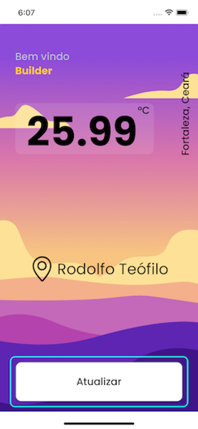

# Weather App

Este é um projeto teste para a Builders, com o objetivo de mostrar alguns conhecimentos em React Native.




<!--  -->

## Possui interesse em desenvolver algum aplicativo mobile?

Contrate-me ;)

Arnoldo Silva</b> - [www.arnoldosilva.com.br](https://www.arnoldosilva.com.br)

## Créditos

Este App utiliza os seguintes pacotes/tecnologias ou assets de uso livre:

- [React.js](https://reactjs.org/)
- [Expo](https://expo.dev/)
- [Moti](https://moti.fyi/)
- [OpenWeather](https://openweathermap.org/)

## Sobre o projeto

Feito em React Native utilizando alguns pacotes e arquiteturas como:

- ContextApi
- Moti
- Stylized Components
- Jest + React Test Library

## Começando

Nesse projeto adicionei as apis para acesso ao openweather e reverse geolocalization mas pretendo invalida-las tão logo a análise, para interessados em estudar a arquiterura do projeto, um arquivo .env será adicionado.

### Pré Requisitos

Este projeto precisa do node instalado, preferência ˆ14.

- yarn

  ```sh
  yarn install
  ```

### Instalação

Basta executar os seguintes passos:

<!-- 1. Get a free API Key at [https://example.com](https://example.com) -->
1. Clone o repositório

   ```sh
   git clone https://github.com/arnoldosilva/weatherapp.git
   ```

2. Install NPM packages

   ```sh
   yarn install
   ```

3. Executar

   ```sh
   yarn ios ou yarn android
   ```

<!-- 4. Enter your API in `config.js`

   ```js
   const API_KEY = 'ENTER YOUR API';
   ``` -->

## Suporte

Ajude este Desenvolvedor a continuar seu sonho em desenvolvimento mobile! Contrate-me!

## Licença

Distribuído sob [MIT](https://github.com/arnoldosilva/vai_chover_hoje/blob/master/LICENSE) Licença. Leia mais em [LICENSE](https://github.com/arnoldosilva/vai_chover_hoje/blob/master/LICENSE)

---

## Contato

<p align="center">
<a href="https://arnoldosilva.com.br">

</a>
<a href="https://www.linkedin.com/in/arnoldosilva/">

</a>
<a href="https://dribbble.com/arnoldosilva">

</a>
<a href="https://wa.me/5585998714767">

</a>
<a href="mailto:contato@arnoldosilva.com.br">

</a>
</p>****
