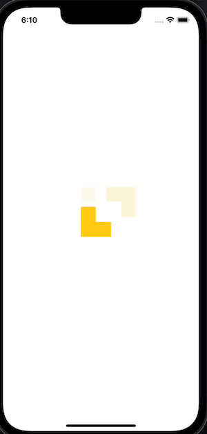

# Weather App

Este é um projeto teste para a Builders, com o objetivo de mostrar alguns conhecimentos em React Native.

<!--  -->

## Possui interesse em desenvolver algum aplicativo mobile?

Deseja levar este App para sua academia?

Arnoldo Silva</b> - [www.arnoldosilva.com.br](https://www.arnoldosilva.com.br)

## Créditos

Este App utiliza os seguintes pacotes/tecnologias ou assets de uso livre:

- [React.js](https://reactjs.org/)
- [Expo](https://expo.dev/)
- [Moti](https://moti.fyi/)
- [OpenWeather](https://openweathermap.org/)

## Sobre o projeto

Feito em React Native utilizando alguns pacotes e arquiteturas como:
-ContextApi
-Moti
-Stylized Components
-Jest + React Test Library

## Suporte

Ajude este Desenvolvedor a continuar seu sonho em desenvolvimento mobile! Contrate-me!

## Licença

Distribuído sob [MIT](https://github.com/arnoldosilva/vai_chover_hoje/blob/master/LICENSE) Licença. Leia mais em [LICENSE](https://github.com/arnoldosilva/vai_chover_hoje/blob/master/LICENSE)

---

## Contato

****
